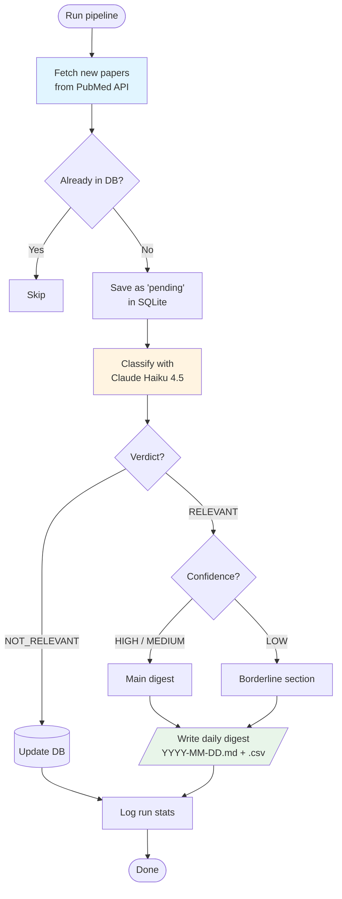

# Pipeline Execution Trace

Technical reference for the execution flow of `run_pipeline.py`. Describes inputs, outputs, and data shapes at each stage. For project goals and design rationale, see `README.md`.

---

## Entry Point

```
python run_pipeline.py
  └── run()
```

---

## Execution Order

### 1. Setup

```
_setup_logging()
  → logs/pipeline.log  (appended)
  → stdout

sqlite3.connect(data/pipeline.db)
_init_db(con)
  → CREATE TABLE IF NOT EXISTS papers
  → CREATE TABLE IF NOT EXISTS runs
```

### 2. Determine Date Range

```
_last_run_date(con)
  → SELECT run_date FROM runs ORDER BY run_date DESC LIMIT 1
  → returns date of last run, or (today - 1 day) if no runs exist

start = last_run_date + 1 day
end   = date.today()
```

### 3. Fetch

```
fetcher.fetch(start, end)
  → _esearch(start, end)
        GET https://eutils.ncbi.nlm.nih.gov/entrez/eutils/esearch.fcgi
        params: db=pubmed, term='"Single-Cell Gene Expression Analysis"[MeSH Terms] AND Journal Article[pt]',
                usehistory=y, datetype=pdat, mindate/maxdate=start/end, retmax=0, retmode=xml
        → returns (web_env, query_key, total_count)
        → returns early with [] if total_count == 0
  → paginated loop (BATCH_SIZE = 200):
        _efetch_batch(web_env, query_key, retstart, retmax)
          → GET https://eutils.ncbi.nlm.nih.gov/entrez/eutils/efetch.fcgi
          → params: db=pubmed, query_key, WebEnv, retstart, retmax, rettype=xml, retmode=xml
          → returns raw XML bytes
        for each PubmedArticle element: _parse_article(article_elem)
          → skips if MedlineCitation, PMID, Article, or ArticleTitle is missing/empty
          → abstract: concatenates all AbstractText elements (handles structured abstracts with Labels)
          → authors: "LastName ForeName" or CollectiveName, joined by ", "
          → category: journal abbreviation from Journal/MedlineTA or MedlineJournalInfo/MedlineTA
          → date: Year-Month-Day from Journal/JournalIssue/PubDate; falls back to Year-Month or Year;
                  falls back to first 4 chars of MedlineDate
          → doi: first ArticleId with IdType="doi" from PubmedData/ArticleIdList;
                 falls back to "pmid:{pmid}" if no DOI present
        deduplication via seen_dois set (per-batch, in-memory)
        sleeps 0.4 s between batches if more remain
  → returns list[paper_dict]
```

**paper_dict shape:**
```python
{
    "doi":      str,   # e.g. "10.1234/example" or "pmid:12345678" if no DOI
    "title":    str,
    "abstract": str,
    "authors":  str,   # "LastName ForeName, …" or CollectiveName
    "category": str,   # journal abbreviation (MedlineTA), e.g. "Nat Methods"
    "date":     str,   # publication date, e.g. "2024-03-15", "2024-03", or "2024"
}
```

### 4. Deduplicate

```
for paper in papers:
    SELECT 1 FROM papers WHERE doi = ?
    if not exists:
        INSERT INTO papers (doi, title, abstract, authors, category, fetch_date, status)
            VALUES (p["doi"], p["title"], p["abstract"], p["authors"], p["category"], p["date"], "pending")
        → append to new_papers
con.commit()
```

The `fetch_date` column is populated from the `date` field returned by `_parse_article` (derived from PubMed publication date fields). If `--force` is passed, papers already in the DB are appended to `new_papers` and reclassified without re-inserting.

### 5. Classify

```
for paper in new_papers:
    try:
        classifier.classify(title, abstract)
          → _prompt()
                returns cached (prompt_text, version) from module-level _PROMPT_CACHE
                on first call, delegates to _load_prompt():
                    glob prompts/classifier_v*.txt → sort → take last (highest version)
                    version = filename minus "classifier_" prefix and ".txt" suffix (e.g. "v1")
          → _get_client() lazily instantiates module-level anthropic.Anthropic() client
          → client.messages.create(
                model  = "claude-haiku-4-5-20251001",
                max_tokens = 256,
                system = [{ type: "text", text: prompt_text,
                            cache_control: { type: "ephemeral" } }],
                messages = [{ role: "user", content: "Title: ...\n\nAbstract: ..." }]
            )
          → "{" + response.content[0].text   (assistant prefill "{" prepended before parsing)
          → _parse_response(raw_text)
                json.loads → validate verdict ∈ {RELEVANT, NOT_RELEVANT}
                           → validate confidence ∈ {HIGH, MEDIUM, LOW}
                           → validate reason is str
                           → validate super_category ∈ {computational, experimental, resource} (if present)
                           → validate sub_category ∈ {new_algorithm, software_tool, benchmark,
                               foundation_model, new_technology, new_platform,
                               protocol_optimization, atlas, dataset, infrastructure} (if present)
                retries once on JSONDecodeError or ValueError
          → result["prompt_version"] = version
          → returns classifier_result

        UPDATE papers SET verdict, confidence, reason, prompt_version, run_id,
                         status='classified', super_category, sub_category
            WHERE doi = ?
        con.commit()
        increment n_relevant or n_not_relevant based on verdict
    except Exception:
        log.error(...)
        increment n_errors
        (paper row is left in 'pending' state with no verdict)
```

**classifier_result shape:**
```python
{
    "verdict":        "RELEVANT" | "NOT_RELEVANT",
    "confidence":     "HIGH" | "MEDIUM" | "LOW",
    "reason":         str,   # ≤25 words
    "super_category": "computational" | "experimental" | "resource" | None,
    "sub_category":   "new_algorithm" | "software_tool" | "benchmark" | "foundation_model"
                    | "new_technology" | "new_platform" | "protocol_optimization"
                    | "atlas" | "dataset" | "infrastructure" | None,
    "prompt_version": str,   # e.g. "v1"
}
```

### 6. Write Digest

```
output.write_digest(db_path, run_id, digests/, today)
  → _rows_for_run(db_path, run_id)
        opens its own sqlite3 connection (row_factory = sqlite3.Row)
        SELECT doi, title, abstract, authors, category, fetch_date,
               verdict, confidence, reason, super_category, sub_category
        FROM papers
        WHERE run_id = ?
        ORDER BY CASE verdict WHEN 'RELEVANT' THEN 0 ELSE 1 END,
                 CASE confidence WHEN 'HIGH' THEN 0
                                 WHEN 'MEDIUM' THEN 1
                                 WHEN 'LOW' THEN 2
                                 ELSE 3 END,
                 title ASC
        closes the connection, returns list[dict]
  → split rows:
        relevant   = rows where verdict == 'RELEVANT'
        main       = relevant where confidence in ('HIGH', 'MEDIUM')
        borderline = relevant where confidence == 'LOW'
  → ensure out_dir exists (os.makedirs(..., exist_ok=True))
  → write digests/YYYY-MM-DD.md
        # scRNA-seq Methods Digest — YYYY-MM-DD
        **N relevant paper[s]** (M borderline)        ← borderline count shown only if any
        main papers grouped by super_category > sub_category:
            ## Computational / ## Experimental / ## Resource  (only non-empty super-cats)
                ### New Algorithm / ### Software Tool / …      (only non-empty sub-cats)
                    for each paper in sub-cat: _paper_block(row)
        ## Uncategorized                               ← main papers with no super/sub category
            for each row: _paper_block(row)
        ## Borderline (LOW confidence — review manually)  ← only if borderline is non-empty
            for each row: _paper_block(row)
        _No relevant papers found in this run._        ← only if relevant is empty
  → write digests/YYYY-MM-DD.csv
        csv.DictWriter with fieldnames =
            [doi, title, authors, category, fetch_date, verdict, confidence,
             super_category, sub_category, reason]
        and extrasaction="ignore" (silently drops the abstract column from rows)
        writes header + all rows (RELEVANT and NOT_RELEVANT)
  → returns (md_path, csv_path)
```

**`_paper_block(row)` formatting:**
```
**[title](https://doi.org/{doi})**          ← link omitted if doi is empty or starts with "pmid:"
{category} · {authors[:80]}[…] · {fetch_date}
_{reason}_ `{confidence}`
```

### 7. Log Run

```
INSERT INTO runs (run_id, run_date, fetched, deduped, relevant, not_relevant, errors)
con.close()
```

---

## Pipeline Flow Diagram



---

## Data Store

**`data/pipeline.db`** — SQLite, two tables:

`papers`

| column         | type | notes                              |
|----------------|------|------------------------------------|
| doi            | TEXT | PRIMARY KEY                        |
| title          | TEXT |                                    |
| abstract       | TEXT |                                    |
| authors        | TEXT |                                    |
| category       | TEXT | journal abbreviation (MedlineTA)   |
| fetch_date     | TEXT | publication date from PubMed XML   |
| verdict        | TEXT | RELEVANT \| NOT_RELEVANT           |
| confidence     | TEXT | HIGH \| MEDIUM \| LOW              |
| reason         | TEXT | ≤25 words from classifier          |
| prompt_version | TEXT | e.g. v1                            |
| run_id         | TEXT | UUID, matches runs.run_id          |
| status         | TEXT | pending → classified               |
| super_category | TEXT | computational \| experimental \| resource (nullable) |
| sub_category   | TEXT | new_algorithm \| software_tool \| … (nullable); added via migration if absent |

`runs`

| column       | type    | notes          |
|--------------|---------|----------------|
| run_id       | TEXT    | PRIMARY KEY    |
| run_date     | TEXT    | ISO date       |
| fetched      | INTEGER |                |
| deduped      | INTEGER | new papers only |
| relevant     | INTEGER |                |
| not_relevant | INTEGER |                |
| errors       | INTEGER |                |

---

## File I/O Summary

| stage      | reads                              | writes                          |
|------------|------------------------------------|---------------------------------|
| setup      | —                                  | logs/pipeline.log               |
| fetch      | PubMed E-utilities API (HTTP)      | —                               |
| deduplicate| data/pipeline.db                   | data/pipeline.db (papers rows)  |
| classify   | prompts/classifier_v*.txt, Anthropic API | data/pipeline.db (papers rows) |
| digest     | data/pipeline.db                   | digests/YYYY-MM-DD.md + .csv    |
| log run    | —                                  | data/pipeline.db (runs row)     |

---

## Project Structure

```
scrna-paper-enrichment/
├── run_pipeline.py           # Entry point — orchestrates all stages
├── validate.py               # Runs classifier against ground-truth fixtures
├── pipeline/
│   ├── __init__.py
│   ├── fetcher.py            # PubMed E-utilities client (esearch + efetch), batched pagination, dedup
│   ├── classifier.py         # Haiku 4.5 wrapper, prompt loader, JSON parser
│   ├── output.py             # Markdown + CSV digest writer
│   └── pdf.py                # PDF helper used by validate.py
├── prompts/
│   └── classifier_v*.txt     # Versioned classifier system prompts
├── data/
│   └── pipeline.db           # SQLite — papers, verdicts, run log (created at runtime)
├── digests/                  # Daily output: YYYY-MM-DD.md + YYYY-MM-DD.csv (created at runtime)
├── logs/
│   └── pipeline.log          # Created at runtime
├── .claude/                  # Agent definitions and slash commands
├── errors.json               # Validation error log
└── shell.nix                 # Nix dev shell
```
